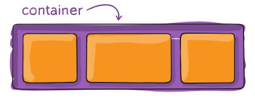
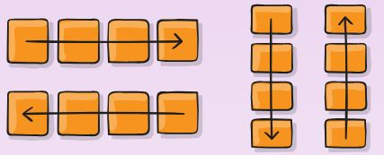
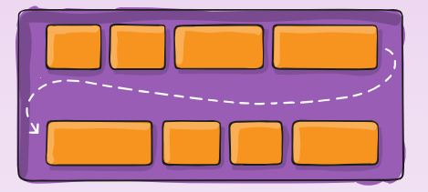
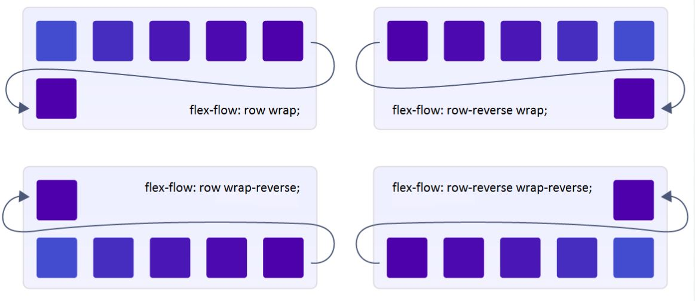
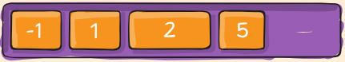
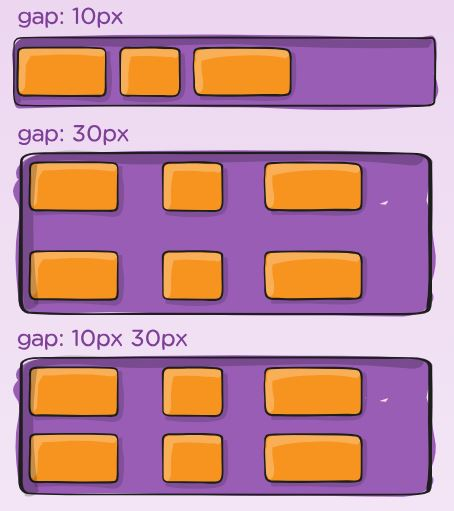
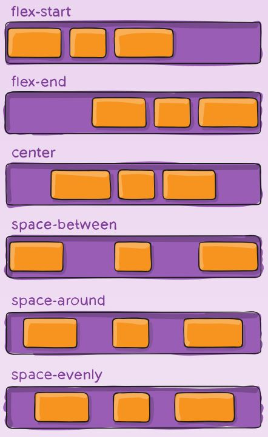
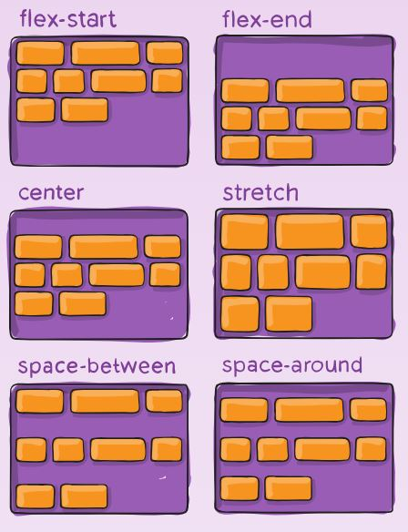
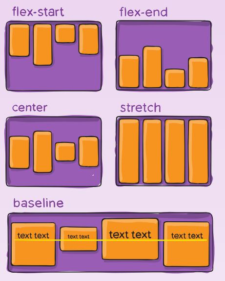
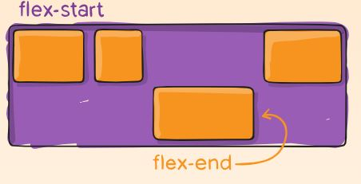

# CSS FlexBox

## Table Of Contents:

- What are Flexbox?
- How to create a Flexbox?
- Flex Direction
- Flex Wrap
- Flex Flow
- Order
- Row gap or column gap
- Positioning of content

## What are CSS Flexbox?

The Flexbox Layout module aims at providing a more efficient way to lay out, align and distribute space among items in a container, even when their size is unknown or dynamic (thus the word “flex”).

The main idea behind the flex layout is to give the container the ability to alter its items width/height to best fill the available space.

### Example of a typical CSS Flexbox  

## How to create a Flexbox?

The syntax for creating a Flexbox is

    .flex-container 
    {
        display: flex; | inline-flex;
    }

Inline Flexbox are used to create flexbox which is an inline element     

## Flex Direction

This creates or defines a main axis in which the flexbox is created.  We can create either ***row*** wise or ***column*** wise  

    .flex-container
    {
        flex-direction: row | row-reverse | column | column-reverse;
    }

## Flex Wrap

This is used to define whether a flex box should wrap around if the space is filled or not  By default, flex items will all try to fit onto one line. You can change that and allow the items to wrap as needed with this property.

#### Syntax:

    .flex-container 
    {
        flex-wrap: nowrap | wrap | wrap-reverse;
    }

    

nowrap: Does not wrap the content. wrap: wraps the content. wrap-reverse: wraps the content in reverse.

## Flex Flow

This is a shorthand for the flex-direction and flex-wrap properties, which together define the flex container’s main and cross axes. The default value is row nowrap.   We can wrap around the column or row.

    .flex-container 
    {
        flex-flow: column wrap; | row wrap;
    }    

## Order

the order property controls the order in which they appear in the flex container. By default all the elements will have 0 order.  This action is performed to each item seperately in the flexbox , so it is defined inside a class. 

    .item 
    {
        order: 5; /* default is 0 */
    }

This assigns *item* to position 5.  

 

## Row gap or column gap

    .flex-container 
    {
        display: flex;
        gap: 10px 20px; /* row-gap column gap */
        row-gap: 10px;
        column-gap: 20px;
    }

 

## Positioning Of Content

We can use some properties to position the contents of the flex in the webpage according to our need  The ways to do these are

1.Justify 
2.Align 
3.Place

##  Justify

Justify is used to align the contents along the main-axis.   The different types of justify are

***flex-start*** :items are packed toward the start of the flex-direction.

***flex-end:*** items are packed toward the end of the flex-direction.

***start:*** items are packed toward the start of the writing-mode direction.

***end:*** items are packed toward the end of the writing-mode direction.

***left:*** items are packed toward left edge of the container.

***right:*** items are packed toward right edge of the container.

***center:*** items are centered along the line

***space-between:*** items are evenly distributed in the line; first item is on the start line, last item on the end line

***space-around:*** items are evenly distributed in the line with equal space around them.

***space-evenly:*** items are distributed so that the spacing between any two items are equal.

**Sample code:**

    .flex-container 
    {
        justify-content: flex-start | flex-end | center | space-between | space-around | space-evenly | start | end | left | right ... + safe | unsafe;
    }

##  Align

There are two types of Align property in flexbox

- align-items
- align-content

### Align-content
This aligns a flex container contents along the vertical axis , similar to how justify aligns it with horizontal axis.

The types in align-content are:

- flexstart
- flexend
- center
- stretch
- space-between
- space-around

it works similar to justify-content.

**sample code:**

    .flex-container 
    {
        align-content: flex-start | flex-end | center | space-between | space-around | space-evenly | stretch;
    }

### Align-items

This defines the default behavior for how flex items are laid out along the cross axis on the current line. Think of it as the justify-content version for the cross-axis 

The types in align-items are:

- flexstart
- flexend
- center
- stretch
- baseline

**sample code:**

    .flex-container 
    {
        align-items: stretch | flex-start | flex-end | center | baseline;
    }

    

### Align-self

It is used to insert a seperate item and align it inside the flexbox

**sample code:**

    .item 
    {
        align-self: auto | flex-start | flex-end | center | baseline | stretch;
    }

 

This concludes all the CSS Flexbox properties

x-----------------------------------------------------x--------------------------------------------------------x

    

