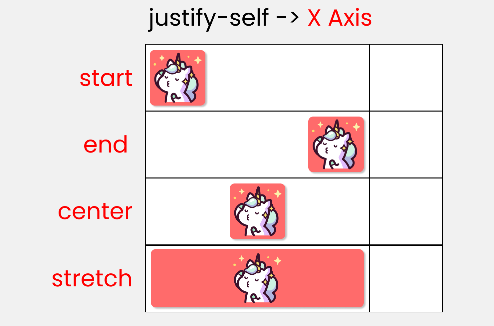

# CSS Grids

## Table Of Contents:

- What are CSS Grids?
- How to create a Grid?
- What are Grid lines?
- Grid Rows and Columns
- Grid container and items
- Grid Gap
- How to fill the Grids
- MinMax
- Auto-fit & Auto-fill
- Auto-flow
- Positioning of content
- Subgrid

## What are CSS Grids?

The **CSS grid layout** module excels at dividing a page into major regions or defining the relationship in terms of size, position, and layer, between parts of a control built from HTML primitives.

Like tables, grid layout enables an author to align elements into ***columns*** and ***rows***. However, many more layouts are either possible or easier with CSS grid than they were with tables. For example, a grid container's child elements could position themselves so they actually overlap and layer, similar to CSS positioned elements.

### Example of a typical CSS Grid  

## How to create a Grid?

The syntax for creating a Grid is

    .grid-container 
    {
     display: grid; | inline-grid;
    }

Inline-grid is used to create a grid which acts as inline instead of block     
This is the basic syntax for creating a Grid.   
We can add rows and columns as we needed.

## What are Grid lines?

CSS grid lines are the lines browsers create on a grid container when you define the **grid-template-columns** or **grid-template-rows property.**  

## Grid Rows and Column

The divison of grids along the vertical axis are called **Columns** and along the horizontal axis are called as **Rows.**

#### Syntax to define Rows and Columns

    .grid-container 
    {
    display: grid;
    grid-template-columns: auto auto auto;
    grid-template-rows:auto auto auto;
    }

Here as we can see **grid-template-columns** or **grid-template-rows** are used to define the number of rows and columns.  
There are various units we can use to define the number of rows and columns.They are:

|Units|Description|
|-----|-----------|
|em|Font size of parent|
|px|equals one pixel value|
|fr|equals one fractional value|
|%|Percentage value|
|auto|automatically fills the space|

#### Repeat Property
As we could see in the previous example we have used the auto property 3 times instead of that we can use the repeat function which mimics the same functionality

    .grid-container 
    {
    display: grid;
    grid-template-columns: repeat(3,auto);
    grid-template-rows:repeat(3,auto);
    }

## Grid container and items

A grid container is the whole grid box and each boxes inside a grid are called as grid items. we can perform different actions on the whole grid or the grid items seperately.  To perform actions on a single grid item we should define that item seperately as

    .grid-container 
    {
    display: grid;
    grid-template-columns: auto auto auto;
    }
    .item1 
    {
        <!-- *any text here* --> 
    }  
as we can see if we want to change properties of item1 we can define it inside item1.   
## Grid Gaps

This property defines the size of the gap between the rows and columns in a grid layout.

    .grid-container 
    {
    display: grid;
    grid-template-columns: auto auto auto auto;
    grid-column-gap: 50px;
    grid-row-gap: 10px;
    }

This creates a 50px gap between each colums and 10px gap between each rows.

#### **Shorthand**:

**syntax**:
    
    grid-gap: 50px;

This leavs a gap of 50px for both rows and columns.    

## How to fill the Grids

This is the most important property , because it teaches us how to actually use our grid. There are
multiple ways to do this they are:
 
 - start and end
 - span
 - shorthand for start and stop
 - start and span
 - Grid Areas
 - Shorthand for Grid Areas

 Now let us see an example and see how to create that using different metods

 

### Start and End
we can define the start and end of both rows and columns we want our item to occupy

    .grid-container 
    {
    display: grid;
    grid-template-columns: auto auto auto;
    }
    .item1 
    {
        grid-column-start: 1;
        grid-column-end: 3;
    }  

Here the item1 will occupy space from column 1 to column 3 and row 1 to 3.

### Span

We can also make our item span as much columns or rows that we want

    .grid-container 
    {
    display: grid;
    grid-template-columns: auto auto auto;
    }
    .item1 
    {
        grid-column-start: span 3;
    }  
Item1 will span for 2 column from where the previous item ended. Similarly we can use grid-column-start: span 2; 

### Shorthand for start and stop

Instead of defining start and stop seperately we can use a shorthand rule to define it both together

    .grid-container 
    {
    display: grid;
    grid-template-columns: auto auto auto;
    }
    .item1 
    {
        grid-column-start:1/3;
    }

The column will span from column 1 to 3.

### Start and span

It is used to define where to start before spanning the given number of rows or columns.

    .grid-container 
    {
    display: grid;
    grid-template-columns: auto auto auto;
    }
    .item1 
    {
        grid-column-start:1/span 3;
    }
It tells the grid to start from row 1 and span across 3 rows.   

### Grid Areas

Defines a grid template by referencing the names of the grid areas which are specified with the ***grid-area*** property. Repeating the name of a grid area causes the content to span those cells. We can use a period(.) if it is a empty grid.

    .container 
    {
    display: grid;
    grid-template-columns: 50px 50px 50px 50px;
    grid-template-areas: 
        "header header header header"
        "main main . sidebar"
        "footer footer footer footer";
    }
    .item-a {
    grid-area: header;
    }
    .item-b {
    grid-area: main;
    }
    .item-c {
    grid-area: sidebar;
    }
    .item-d {
    grid-area: footer;
    }
output:
    

### Shorthand for Grid Areas

**syntax:**

    grid-area: start row | start column | end row | end column
so instead of defining the grid area rows and columns seperately we can use shorthand.

## MinMax

Sometimes if we don't know the exact space our grid would occupy and if we want to adjust it based on the content in the grid itself , we can use minmax ,***min-content*** would force the grid to occupy the minimum space required by the biggest content in the grid and ***max-content***   does the vice versa.

**Example for min-content**

**Example for max-content**

There is also a Keyword ***minmax*** by which we can define the minimum and maximum allowed sixe of a grid.

    .grid-container
    {
    display: grid;
    grid-template-columns: minmax(0px, 500px) 1fr 1fr;
    }

**ouput:**

## Auto

Auto keyword is used to automatically fill the gaps in our grid. This can be done in two ways 

- auto-fill
- auto-fit

**auto-fill:** Fit as many possible columns as possible on a row, even if they are empty.  
**auto-fit:** Fit whatever columns there are into the space. Prefer expanding columns to fill space rather than empty columns.

**syntax:**

    grid-template-columns: repeat(auto-fit, minmax(180px, 1fr) );

    grid-template-columns: repeat(auto-fill, minmax(180px, 1fr) );

**output:**

## Auto-flow

If we have grid items that you don’t explicitly place on the grid, the auto-placement algorithm kicks in to automatically place the items. This property controls how the auto-placement algorithm works.

There are three types of auto-flow values

**Row** – tells the auto-placement algorithm to fill in each row in turn, adding new rows as necessary (default)

**Column** – tells the auto-placement algorithm to fill in each column in turn, adding new columns as necessary

**Dense** – tells the auto-placement algorithm to attempt to fill in holes earlier in the grid if smaller items come up later

## Positioning Of Content

We can position and arrange the items in the grid or the whole grid itself however we want using differnet commands. These contents are

1.Justify 
2.Align 
3.Place

##  Justify

###  1. justify-content:
 
We can use this property to position the whole grid  inside the grid container along the X-Axis.
 

Sample Code:
 
        .container {
            display: grid;
            gap: 50px;
            grid-template-rows: 200px 200px;
            grid-template-columns: 200px 200px;
 
            justify-content : center;
        }
 

 ### 2. justify-items:
 
We can use this property to position grid-items inside grid containers along the X-Axis.
 

Sample Code:

 
        .container {
            display: grid;
            gap: 50px;
            grid-template-rows: 200px 200px;
            grid-template-columns: 200px 200px;
 
            justify-items : end;
        }

### 3. justify-self:
 
We can use this property to position 1 individual grid-item inside a grid container along the X-Axis.
 

Sample code:
 
    .box-1 {
        justify-self : start;  
    }

##  Align

         
###  1. align-content
 
We can use this property to position our grid inside the grid container along the Y-Axis.
 

Sample code:
 
        .container {
            display: grid;
            gap: 50px;
            grid-template-rows: 200px 200px;
            grid-template-columns: 200px 200px;
 
            align-content : space-between;
        }

 
###  2. align-items:
 
We can use this property to position grid-items inside the grid container along the Y-Axis.
 

Sample code:
 
        .container {
            display: grid;
            gap: 50px;
            grid-template-rows: 200px 200px;
            grid-template-columns: 200px 200px;
 
            align-items : center;
        }
 

 

###  3. align-self:
 
We can use this property to position 1 individual grid-item (child) inside a grid container along the Y-Axis.
 

Sample code:
 
    .box-1 {
        align-self : start;  
    }

##  Place

###  1.  place-content:
 
This is the shorthand of 2 properties:
 
- align-content
- justify-content

Syntax:
 
>place-content: align-content / justify-content;
 
        align-content : center;
        justify-content : end;
 
        /* The shorthand */
        place-content : center / end ;
       
 
### 2. place-items:
 
This is the shorthand of 2 properties:
 
- align-items
- justify-items

Syntax:
 
>place-items: align-items / justify-items;
 
        align-items : end;
        justify-items : center;
 
        /* The shorthand */
        place-items : end / center ;
 
### 3. place-self:
 
This is the shorthand of 2 properties:
 
- align-self
- justify-self

Syntax:
 
>place-self: align-self / justify-self;
 
        align-self : start ;
        justify-self : end ;
 
        /* The shorthand */
        place-self : start / end ;

## Sub Grids

CSS subgrid is a value used in place of a list of grid tracks. The rows and columns the element is spanning from its parent, are now the same rows and columns it offers. 

    .grid-items
    {
        grid-column:2/7;
        display:grid;
        grid-template-columns:subgrid;
    }
    .child-of-grid-item
    {
        grid-column:3/6
    }

now inside the main grid column , child grid spans from 3 to 6.

This concludes all the CSS Grid properties

x-----------------------------------------------------x--------------------------------------------------------x

 

